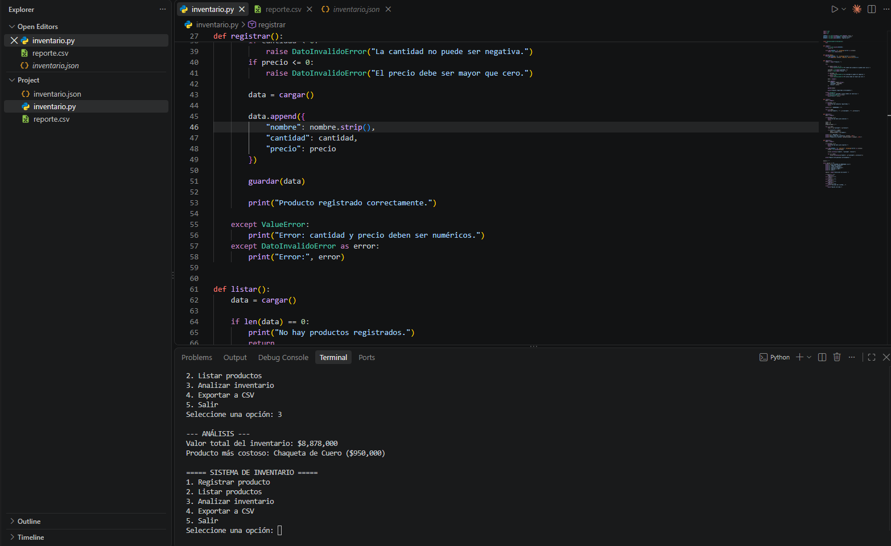
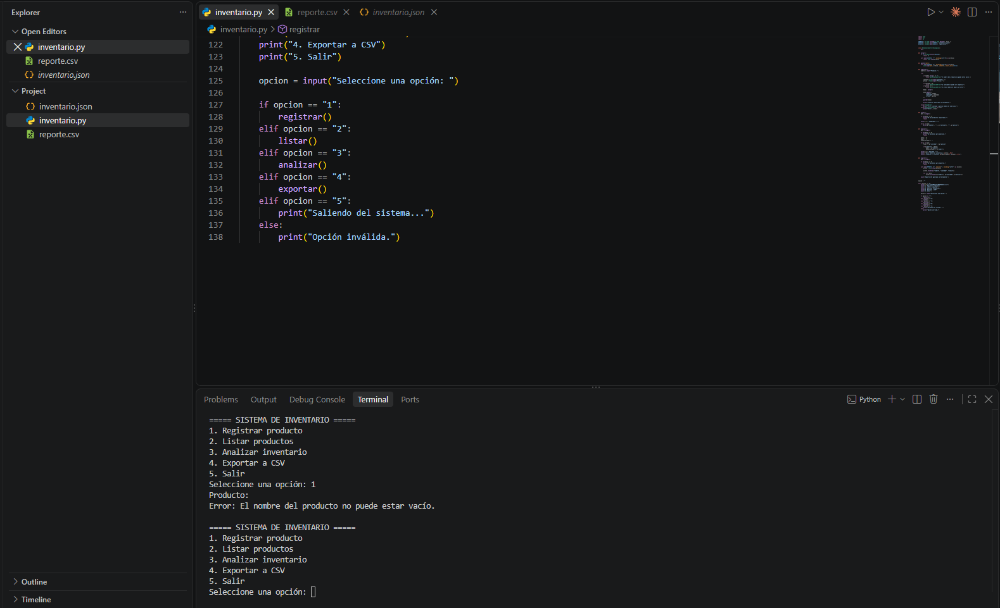

# Inventory Manager (Python · JSON · CSV)

Console inventory system that stores products in JSON, validates user input with custom
exceptions, calculates basic inventory metrics and exports a CSV report.

*Sistema de inventario en consola: guarda productos en JSON, valida los datos con excepciones
personalizadas, calcula métricas del inventario y exporta un reporte en CSV.*

## Features

- **Register products** (name, quantity, price) persisted to `inventario.json`
- **Data validation**: empty names, negative quantities, non-positive prices and non-numeric
  values are rejected through a custom `DatoInvalidoError` exception and `ValueError` handling
- **Analysis**: total inventory value (quantity × price) and most expensive product
- **Export** the inventory to `reporte.csv` for use in Excel or Power BI

## Tech

Python standard library only: `json`, `csv`, `os`, custom exceptions.

## How to run

Requires Python 3.8+.

```bash
python inventario.py
```

```
===== SISTEMA DE INVENTARIO =====
1. Registrar producto
2. Listar productos
3. Analizar inventario
4. Exportar a CSV
5. Salir
```

With the sample data included, option 3 returns:

```
--- ANÁLISIS ---
Valor total del inventario: $8,878,000
Producto más costoso: Chaqueta de Cuero ($950,000)
```

## Screenshots

**Inventory analysis**



**Input validation**



## Files

| File | Description |
|---|---|
| `inventario.py` | Main application |
| `inventario.json` | Sample product data (motorcycle gear store) |
| `reporte.csv` | Sample CSV export |

## Author

**Juan Sebastián Perlaza** — Data Analyst | SQL · Python · Power BI
[LinkedIn](https://www.linkedin.com/in/sebastianperlaza) ·
[GitHub](https://github.com/SebasPerlaza895)
